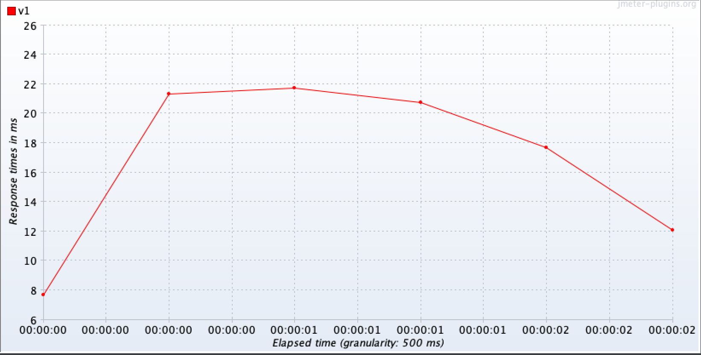
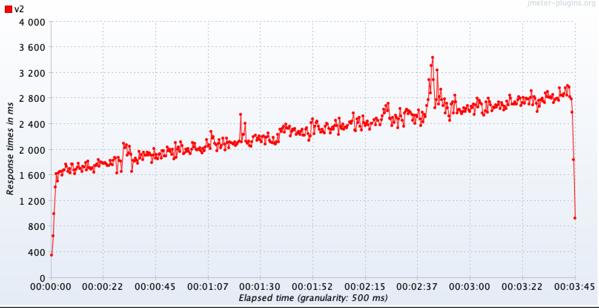

# Домашнее задание к лекции 4 «Проведение нагрузочного тестирования DB»

[Задание.](https://github.com/netology-code/loadqa-homeworks/blob/main/4.Load%20db/homework_lecture4.md)

### Сделано:

## Cреда нагрузочного тестирования:
  * Установлен [Docker](https://github.com/netology-code/aqa-homeworks/blob/master/docker/installation.md).
  * Установлен [DBeaver](https://dbeaver.io/download/).
  * Установлен [JMeter](https://github.com/netology-code/iqa-homeworks/blob/iqa-64/Instruction.md).


## Сделано:

#### 1. Запуск сайта WordPress
  * В процессе выполнения задач по нагрузочному тестированию базы данных была проведена настройка проекта WordPress, который позволяет создавать сайты без знания языков программирования.
    * Команды для подготовки и запуска проекта:
```bash
   # Переход в директорию для хранения проекта:
   cd ~/Documents/Performance_testingQA79

   # Клонирование репозитория проекта:
   git clone https://github.com/mshegolev/congenial-potato.git

   # Переход в каталог WordPress и открытие папки wp в Visual Studio Code:
   cd congenial-potato/wp && code .
```
  * Для совместимости плагинов в `docker-compose.yml` изменен образ контейнера на `image: wordpress:php8.0`.
    * Добавлена строка `platform: linux/x86_64`, чтобы указать Docker на создание образов для архитектуры x86_64 (необходимо для работы на Apple M1 с архитектурой ARM).
    * Чтобы избежать предупреждения при запуске контейнеров удалена строка `version: '3'`.
      * В версиях Docker Compose 2.0 и выше больше не требуется указывать версию файла, так как композитор теперь автоматически обрабатывает данные. Это упрощает работу и делает файлы конфигурации более понятными.
  * Запущены контейнеры с помощью Docker и проверено их состояние:
```bash
   # Запуск контейнеров Docker в фоновом режиме
   docker-compose up -d

   # Проверка запущенных контейнеров
   docker ps
```
  * В браузере по адресу `localhost:80` указанном в `docker-compose.uml` запущен сайт WordPress.
    * Выбран язык.
    * Заполнены все поля: название сайта, имя пользователя, email, придуман пароль, ☑️. 
    * При добавлении комментария на странице по адресу `http://localhost/привет-мир`, я убедился, что комментарий был добавлен успешно.

#### 2.Подключение к базе данных WordPress
  * Подключение к базе данных [MariaDB](https://mariadb.com/kb/ru/a-mariadb-primer/) было успешно выполнено с использованием DBeaver, который используется для работы с системой управления базами данных (СУБД).
    * В DBeaver была выбрана база данных MariaDB и настроено подключение с использованием следующих данных, взятых из файла `docker-compose.yml`
      * host: `localhost` port: `3306`
      * database: `wpdb`
      * username: `wpuser`
      * password: `wppassword`
    * Также были загружены файлы драйвера для MariaDB.

#### 3. Установка [хранимой процедуры](https://ru.wikipedia.org/wiki/%D0%A5%D1%80%D0%B0%D0%BD%D0%B8%D0%BC%D0%B0%D1%8F_%D0%BF%D1%80%D0%BE%D1%86%D0%B5%D0%B4%D1%83%D1%80%D0%B0) базы данных WordPress
  * Произведена проверка доступа к комментарию: Базы данных => wpdb => Таблицы => wp_comments
  * Скопирован файл с хранимой процедурой [`scripts.sql`](scripts.sql) и перенесен в DBeaver. В `меню` выбрано `Редактор SQL` и создан новый редактор, где был вставлен скопированный код.
    * ▶️ Выделен код и вызвана команда на удаление хранимой процедуры `drop procedure if exists dorepeat_v1;`, так как в процедуре были внесены изменения — комментарий `comment` был изменен на `дождь`.
    * ▶️ Затем выделен весь код, относящийся к хранимой процедуре `dorepeat_v1`, который заканчивается ключевым словом `END`, и была вызвана команда для создания процедуры.
    * ▶️ Для создания процедуры `dorepeat_v2`, выделен полный код, заканчивающийся на `END`, и выполнена команда для её создания (команда на удаление для `dorepeat_v2` не потребовалась, так как данная процедура до этого не существовала).
    * 🔁 Обновлена папка `Процедуры`, чтобы убедиться, что процедуры созданы.

#### 4. Проверка работы хранимой процедуры
  * Вызов хранимой процедуры: 
    * ▶️ Выполнена команда на запуск процедуры `CALL dorepeat_v1(5);` для создания 5 комментариев со словом «дождь», указанным в хранимой процедуре `dorepeat_v1`.
      * Так как тестовые записи были созданы напрямую в базу данных, не отработала логика работы счетчика количества комментариев на тестируемой странице `http://localhost/привет-мир`. Перед тестированием следует уточнить, насколько важно, чтобы какая-то логика отрабатывала и не терялась.
    * ▶️ Для создания 5 комментариев со словом «солнце» была вызвана команда `CALL dorepeat_v2(5,'солнце');`.
      * В отличие от хранимой процедуры v1, в процедуре v2, помимо текста указывался также номер комментария (1солнце, 2солнце и т. д.).
    * ▶️ Для удаления комментариев выполнен код `DELETE FROM wp_comments...`, относящийся к очистке базы данных.
  
#### 5. Настройка запуска хранимых процедур при помощи JMeter
  * Скачан [JDBC-драйвер для MySQL](https://dev.mysql.com/downloads/connector/j/) и помещен в папку lib внутри каталога JMeter:
```bash
   mv ~/Downloads/mysql-connector-j-8.4.0.jar /Applications/apache-jmeter-5.6.3/lib
```
  * Скачанный файл [`wp_db_test.jmx`](wp_db_test.jmx) был перемещен в директорию для хранения тестов производительности и запущен с помощью JMeter для проведения нагрузочного тестирования базы данных:
```bash
   # Созданы папки для хранения проекта:
   mkdir -p ~/Documents/Performance_testingQA79/Database_load_testing/jmeter-tests
             
   # Перемещение файла .jmx в директорию:
   mv ~/Downloads/wp_db_test.jmx ~/Documents/Performance_testingQA79/Database_load_testing/jmeter-tests

   # # Переход в директорию:
   cd ~/Documents/Performance_testingQA79/Data_load-testing/jmeter-tests

   #Открытие теста в JMeter:
   jmeter -t wp_db_test.jmx 
```
  * Установлены графики в JMeter (Add => Listener => jp@gc - Назввание графика)
    * Hits per Second (HPS, запросов в секунду)
      * График Hits per Second (HPS) в Apache JMeter отображает количество HTTP-запросов, поступающих на сервер за одну секунду, и помогает оценить его производительность и нагрузку.
    * Transactions per Second (TPS, транзакций в секунду)
      *  Этот график является одним из ключевых индикаторов производительности приложения и позволяет оценить, насколько эффективно система справляется с нагрузкой.
    * Response Times Over Time (Время отклика с течением времени) 
      * Этот график отображает время отклика запросов по мере выполнения теста. Можно увидеть, как время отклика изменяется, например, в зависимости от увеличения нагрузки.
     
#### 6. Автоматизация запуска хранимых процедур при помощи JMeter    
  * В системе была вызвана настройка **Set Up**, в которой использовалось 5 пользователей. В этой настройке группа **readers** и **writers** была закомментирована (Disable), и тест был запущен.
  * Затем была закомментирована группа **readers**, и группа **Set Up** была отключена, в то время как группа **writers** была раскомментирована, чтобы вызвать хранимую процедуру `v2`.  
  * Были сделаны скриншоты графиков процедуры `v2` для дальнейшего сравнения с процедурой `v1`.
  * После этого была закомментирована группа **writers v2**, и вызвана хранимая процедура `v1`.
  * Были сделаны [скриншоты](dorepeat-report) в качестве доказательства того, что процедура `v2` работает медленнее, чем процедура `v1`.
    
<p align="center">


</p>


<br>
<br>

-----


<details>
  <summary>Если во время теста появится ошибка:</summary>

    По умолчанию для работы JMeter компьютер выделяет 1 GB памяти, чтобы обеспечить стабильную работу тестов на машине. Однако, для ресурсоемких тестов, этого объема может не хватать, что приводит к ошибкам из-за нехватки памяти.
    Решением в этой ситуации является увеличение выделенной для JMeter памяти:

    Откройте файл jmeter.bat, если работаете в Windows, или jmeter.sh, если работаете на Linux или на Mac, в текстовом редакторе.
    Найдите строчку:

        set HEAP=-Xms1g -Xmx1g

    Увеличьте память до комфортного вам объема. Учтите, что JMeter не должен использовать всю память вашего компьютера, поэтому не выделяйте больше памяти, чем у вас доступно. Рекомендуется установить 2 GB, этого должно быть достаточно для ваших задач:

        set HEAP=-Xms2g -Xmx2g
</details>

### Дополнительная информация
- [build-db-test-plan](https://jmeter.apache.org/usermanual/build-db-test-plan.html) — инструкция создания теста DB с нуля.
- [mysql-db-driver](https://dev.mysql.com/downloads/connector/j/) — драйвер с официального сайта для установка в JMeter/Lib.

